# Практическая работа 4. Создание баг-репортов

- ФИО: Храмов Даниил Романович
- Группа: 9ИС-495К
- Дисциплина: Обеспечение качества КС
- Дата проверки: 19.03.2026
- Проверяемая версия сайта: `http://www.nke.ru/`

## TL;DR

В ходе проверки было зафиксировано `15` подтвержденных дефектов в меню, поиске, форме онлайн-приемной, мобильной версии и внутренних разделах сайта.

---

## BG-01. Телефонные номера в шапке ведут на страницу приемной комиссии вместо звонка

- Категория: ссылки на другую страницу
- URL: `http://www.nke.ru/`
- Примеры ссылок:
  - `+7(383)226-35-69`
  - `+7(383)236-12-22`
  - `+7(383)225-86-31`
- Шаги воспроизведения:
  1. Открыть главную страницу.
  2. Нажать на один из телефонных номеров в правой части шапки.
- Фактический результат: номер ведет на страницу `http://nke.ru/applicants/the_admissions_committee/`, а не инициирует звонок.
- Ожидаемый результат: номер должен быть ссылкой формата `tel:` или не должен выглядеть как интерактивный элемент.
- Важность: высокая
- Срочность: высокая
- Приложение: добавить свой скриншот
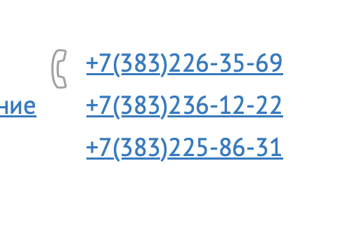
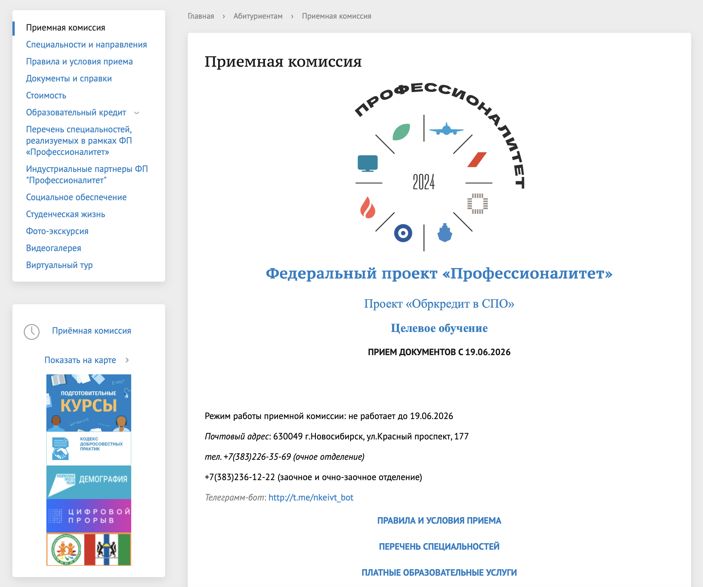
## BG-02. В меню есть опечатка «Профессиооналы»

- Категория: меню / опечатка в тексте
- URL: `http://www.nke.ru/`
- Проблемный фрагмент: `Мастерские "Профессиооналы"`
- Шаги воспроизведения:
  1. Открыть главную страницу.
  2. Просмотреть пункты меню и футера.
- Фактический результат: слово `Профессионалы` написано с двойной буквой `о`.
- Ожидаемый результат: пункт меню должен называться `Мастерские "Профессионалы"`.
- Важность: низкая
- Срочность: планово
- Приложение: добавить свой скриншот
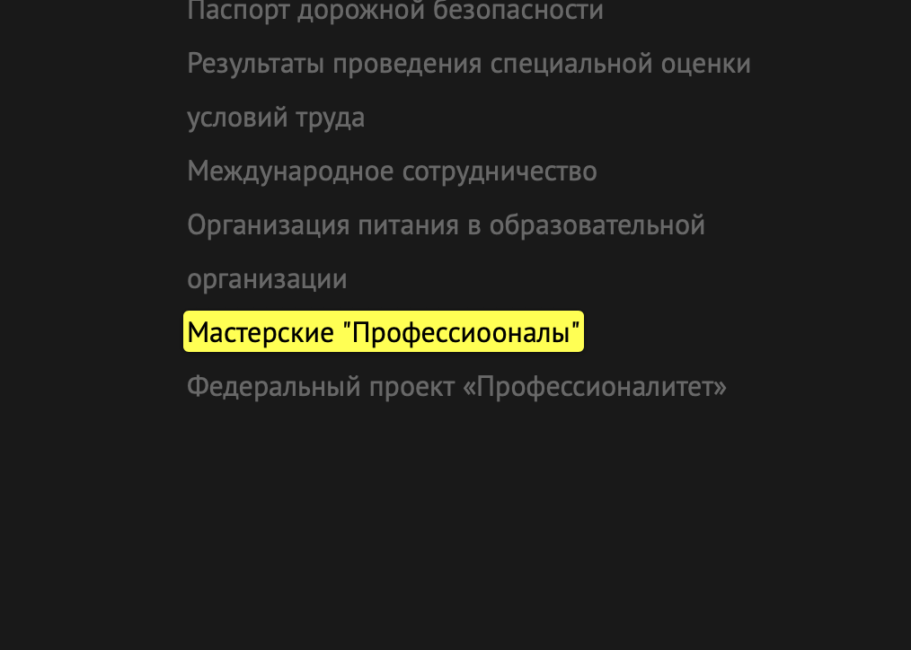

## BG-03. В новости допущена опечатка «Телеграмм-чат»

- Категория: опечатка в тексте
- URL: `http://www.nke.ru/about_the_university/news/4245/`
- Проблемный заголовок: `Телеграмм-чат с психологами для семей участников СВО`
- Шаги воспроизведения:
  1. Открыть раздел новостей.
  2. Перейти в новость с указанным заголовком.
- Фактический результат: в слове `Телеграмм` допущена орфографическая ошибка.
- Ожидаемый результат: должно быть написано `Телеграм-чат` или `Telegram-чат`.
- Важность: низкая
- Срочность: планово
- Приложение: добавить свой скриншот
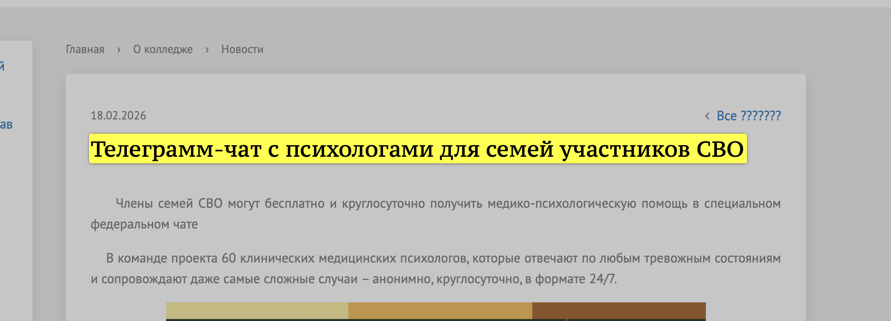

## BG-04. Поиск принимает запрос из пробелов и переводит пользователя на страницу синтаксической ошибки

- Категория: поиск
- URL: `http://www.nke.ru/search/index.php?q=%20%20%20`
- Шаги воспроизведения:
  1. Ввести в поиск несколько пробелов.
  2. Нажать Enter или кнопку поиска.
- Фактический результат: открывается страница поиска с сообщением об ошибке и подсказками по синтаксису поискового запроса.
- Ожидаемый результат: пробельный запрос должен считаться пустым, а пользователь должен получить простое сообщение `Введите поисковый запрос`.
- Важность: средняя
- Срочность: обычная
- Приложение: добавить свой скриншот
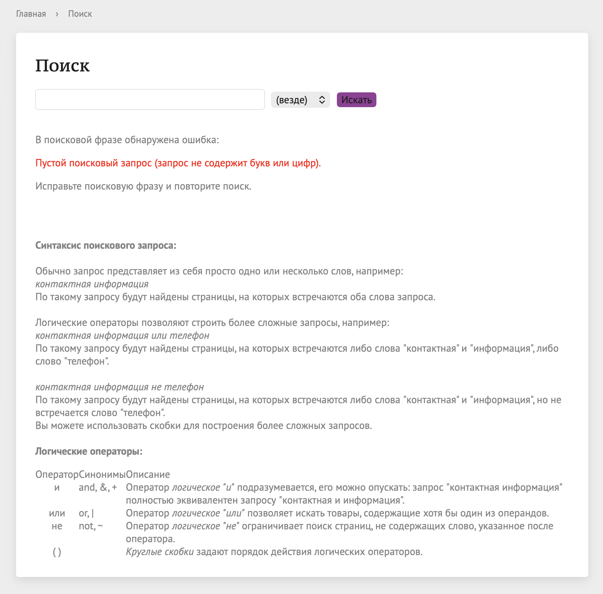

## BG-05. Поиск по бессмысленному запросу возвращает нерелевантные результаты

- Категория: результаты поиска
- URL: `http://www.nke.ru/search/index.php?q=фывафыва`
- Шаги воспроизведения:
  1. Ввести в поиск запрос `фывафыва`.
  2. Отправить форму поиска.
- Фактический результат: в выдаче появляются материалы сайта, не связанные с запросом.
- Ожидаемый результат: по бессмысленному запросу пользователь должен получить сообщение о том, что результаты не найдены.
- Важность: средняя
- Срочность: обычная
- Приложение: добавить свой скриншот
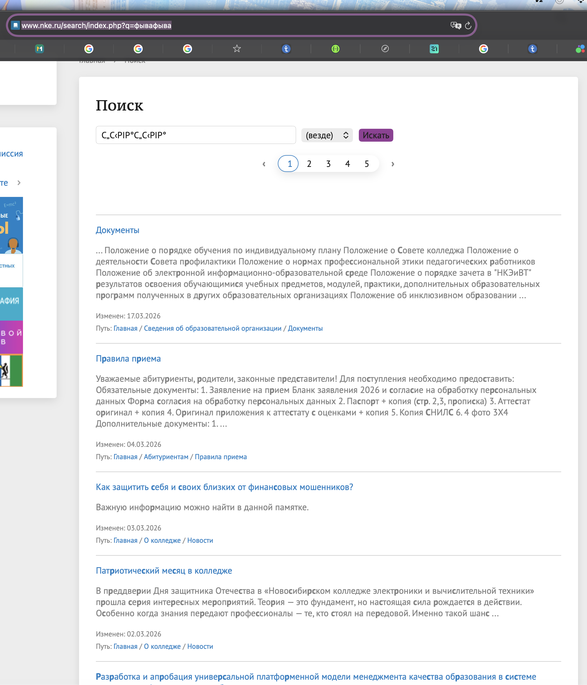

## BG-06. Поиск формирует дублирующиеся и некорректно подписанные результаты для одной и той же страницы

- Категория: результаты поиска
- URL: `http://www.nke.ru/search/index.php?q=расписание`
- Примеры из выдачи:
  - `Расписание`
  - `Расписание Подготовительные курсы`
  - `Расписание занятий`
- Шаги воспроизведения:
  1. Выполнить поиск по слову `расписание`.
  2. Просмотреть верхнюю часть выдачи.
- Фактический результат: одна и та же страница расписания показывается в выдаче под несколькими названиями.
- Ожидаемый результат: каждая страница должна отображаться в выдаче один раз и с корректным заголовком.
- Важность: средняя
- Срочность: обычная
- Приложение: добавить свой скриншот
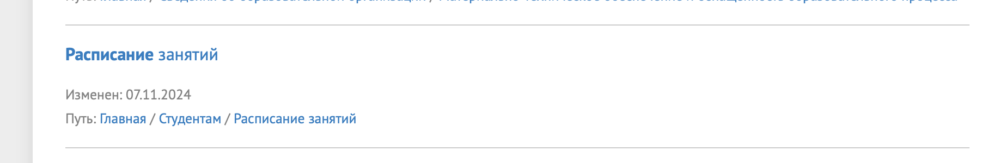
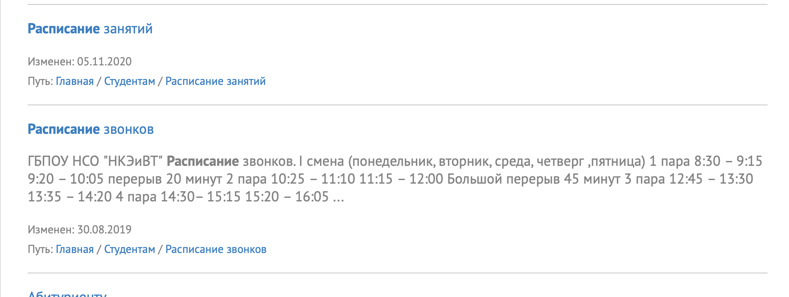

## BG-07. Во фрагментах поисковой выдачи ломается подсветка и слова распадаются на отдельные буквы

- Категория: результаты поиска / некрасивое отображение
- URL: `http://www.nke.ru/search/index.php?q=расписание`
- Шаги воспроизведения:
  1. Выполнить поиск по слову `расписание`.
  2. Просмотреть текстовые фрагменты в результатах поиска.
- Фактический результат: отдельные слова в сниппетах отображаются с разрывами, например по типу `Pyt h on`, `JavaS c ript`, `P H P`.
- Ожидаемый результат: подсветка совпадений не должна ломать слова и переносы.
- Важность: средняя
- Срочность: обычная
- Приложение: добавить свой скриншот
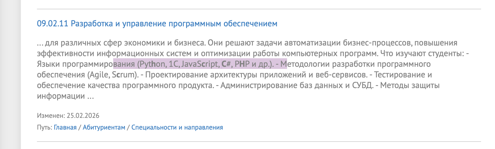

## BG-08. В форме онлайн-приемной поле email оформлено как обычное текстовое поле

- Категория: форма онлайн-приемной
- URL: `http://www.nke.ru/applicants/the_admissions_committee/`
- Проблемное поле: `Адрес электронной почты`
- Шаги воспроизведения:
  1. Открыть страницу приемной комиссии.
  2. Прокрутить страницу до блока `Онлайн приемная`.
  3. Проверить HTML и поведение поля email.
- Фактический результат: для email используется `input type="text"`, встроенная браузерная проверка email не работает.
- Ожидаемый результат: поле должно использовать `input type="email"` с корректной валидацией.
- Важность: высокая
- Срочность: высокая
- Приложение: добавить свой скриншот

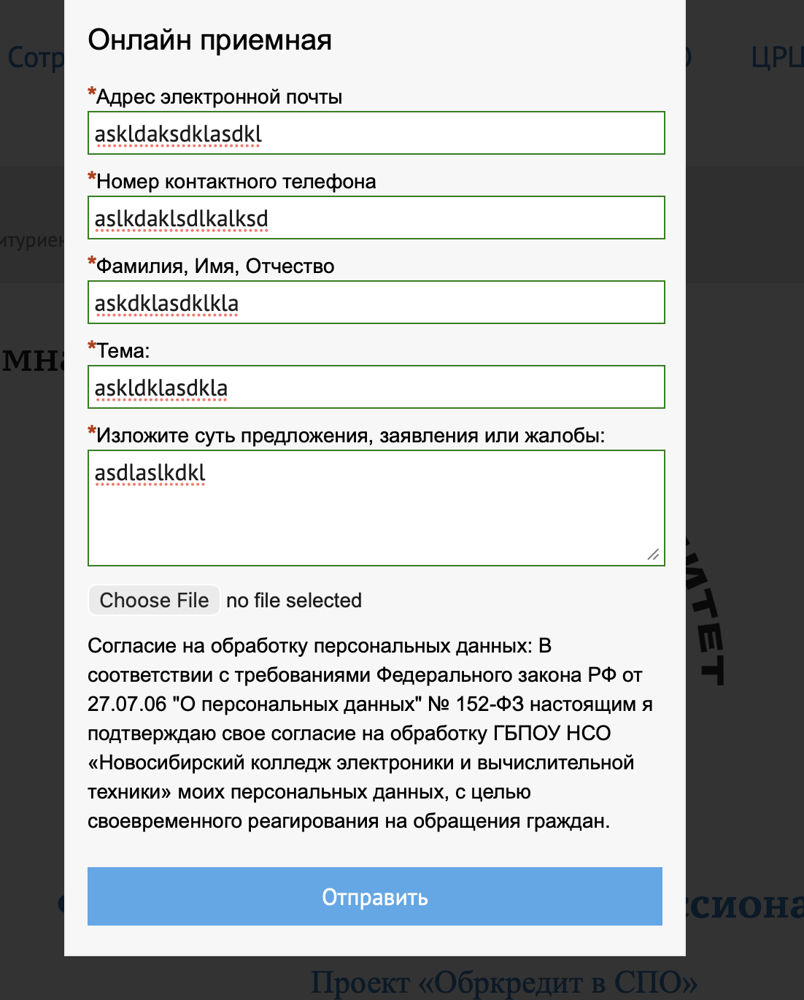
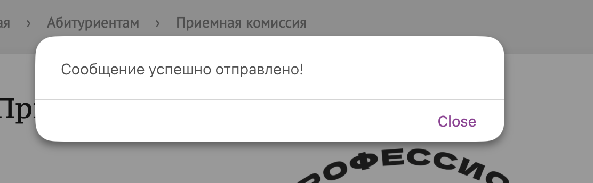

## BG-09. В форме онлайн-приемной поле телефона оформлено как обычное текстовое поле

- Категория: форма онлайн-приемной
- URL: `http://www.nke.ru/applicants/the_admissions_committee/`
- Проблемное поле: `Номер контактного телефона`
- Шаги воспроизведения:
  1. Открыть страницу приемной комиссии.
  2. Найти блок `Онлайн приемная`.
  3. Проверить HTML и поведение поля телефона.
- Фактический результат: для телефона используется `input type="text"`, цифровая клавиатура и базовая проверка телефонного формата не задействуются.
- Ожидаемый результат: поле должно использовать `input type="tel"`.
- Важность: высокая
- Срочность: высокая
- Приложение: добавить свой скриншот

## BG-10. Согласие на обработку персональных данных в форме приемной есть только текстом, без отдельного подтверждения

- Категория: форма онлайн-приемной
- URL: `http://www.nke.ru/applicants/the_admissions_committee/`
- Шаги воспроизведения:
  1. Открыть блок `Онлайн приемная`.
  2. Просмотреть нижнюю часть формы перед кнопкой `Отправить`.
- Фактический результат: согласие на обработку персональных данных выведено обычным текстом, отдельный checkbox для подтверждения отсутствует.
- Ожидаемый результат: пользователь должен явно подтверждать согласие отдельным checkbox перед отправкой формы.
- Важность: высокая
- Срочность: срочно
- Приложение: добавить свой скриншот
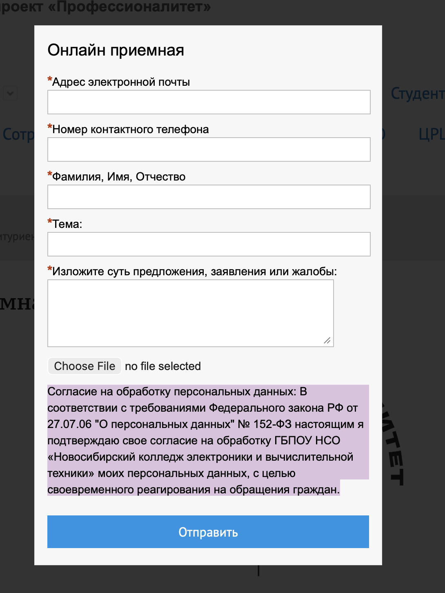
## BG-11. На мобильной версии шапка сайта перегружена и плохо читается

- Категория: мобильная версия сайта
- URL: `http://www.nke.ru/`
- Устройство: мобильная ширина экрана
- Шаги воспроизведения:
  1. Открыть главную страницу на смартфоне или в мобильной эмуляции.
  2. Просмотреть верхнюю часть страницы.
- Фактический результат: длинное название колледжа, федеральный проект и контактный блок слишком сильно сжимаются, верхняя часть страницы выглядит перегруженной и трудной для восприятия.
- Ожидаемый результат: в мобильной версии шапка должна быть переработана так, чтобы текст и контакты читались легко.
- Важность: средняя
- Срочность: обычная
- Приложение: добавить свой скриншот
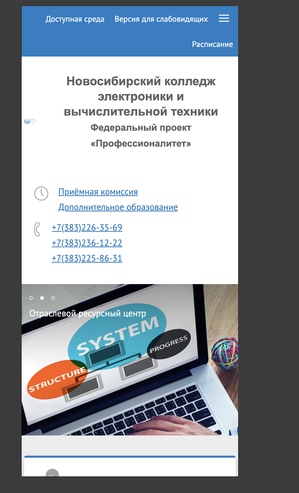
## BG-12. В футере есть опечатка «Телеграмм»

- Категория: футер / опечатка в тексте
- URL: `http://www.nke.ru/`
- Проблемный фрагмент: `Телеграмм`
- Шаги воспроизведения:
  1. Открыть главную страницу сайта.
  2. Прокрутить страницу до футера.
  3. Проверить подпись ссылки на Telegram-канал.
- Фактический результат: ссылка в футере подписана как `Телеграмм`.
- Ожидаемый результат: должно быть написано `Телеграм` или `Telegram`.
- Важность: низкая
- Срочность: планово
- Приложение: добавить свой скриншот

## BG-13. На странице «Портфолио выпускников» отображается заглушка «Текст в разработке»

- Категория: незаполненная страница
- URL: `http://www.nke.ru/rabotodatelyam/portfolio-vypusknikov/`
- Шаги воспроизведения:
  1. Открыть раздел `Работодателям`.
  2. Перейти на страницу `Портфолио выпускников`.
- Фактический результат: в основном содержимом страницы отображается только фраза `Текст в разработке`.
- Ожидаемый результат: страница должна содержать полноценный контент, либо ссылка на нее должна быть скрыта до завершения наполнения.
- Важность: средняя
- Срочность: обычная
- Приложение: добавить свой скриншот
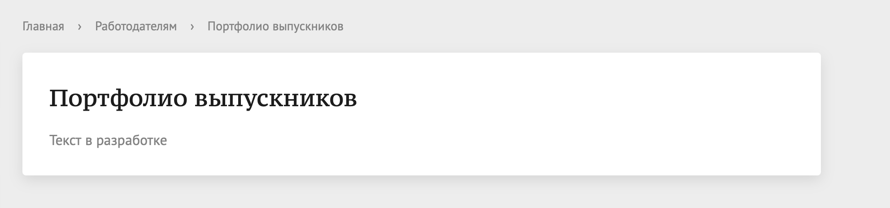
## BG-14. Страница «Проекты» в разделе ОРЦ открывается без основного контента

- Категория: незаполненная страница
- URL: `http://www.nke.ru/orts/projekt/`
- Шаги воспроизведения:
  1. Открыть раздел `ОРЦ`.
  2. Перейти на страницу `Проекты`.
- Фактический результат: на странице отображается только заголовок `Проекты`, без описания, карточек, ссылок или другого основного содержимого.
- Ожидаемый результат: страница должна содержать информацию о проектах или быть недоступна до наполнения.
- Важность: средняя
- Срочность: обычная
- Приложение: добавить свой скриншот
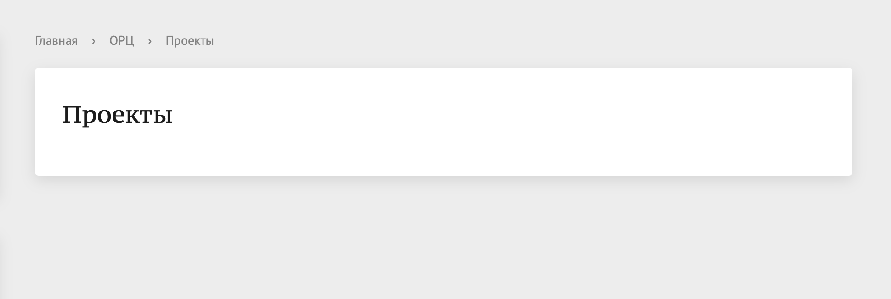
## BG-15. На странице «Студенческая жизнь» отображается служебный текст «****»

- Категория: незаполненная страница / некорректное отображение
- URL: `http://www.nke.ru/students/life/`
- Шаги воспроизведения:
  1. Открыть раздел `Студентам`.
  2. Перейти на страницу `Студенческая жизнь`.
  3. Просмотреть нижнюю часть основного содержимого после списка ссылок.
- Фактический результат: на странице отображается посторонний текст `****`, похожий на заглушку или служебный остаток шаблона.
- Ожидаемый результат: в пользовательском интерфейсе не должно быть служебных символов или незавершенных блоков.
- Важность: средняя
- Срочность: обычная
- Приложение: добавить свой скриншот
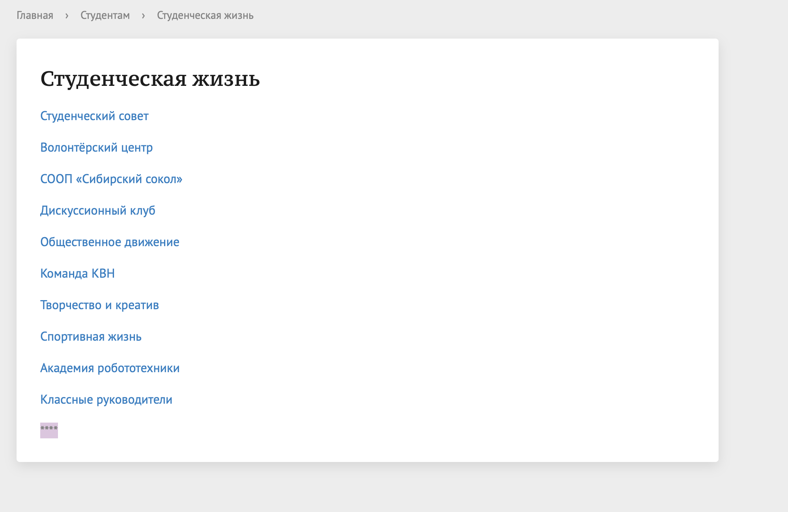