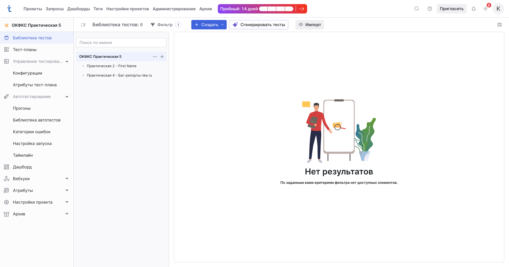
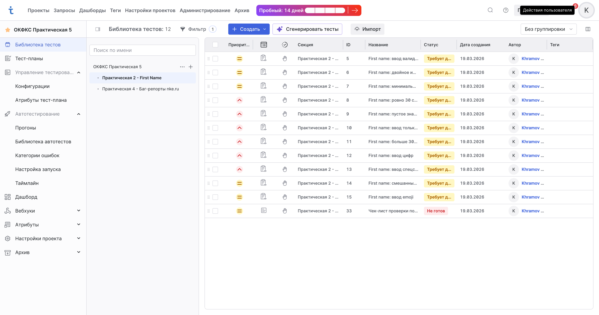
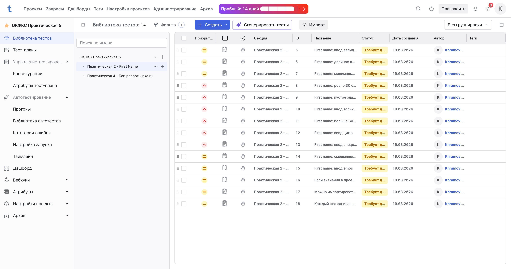
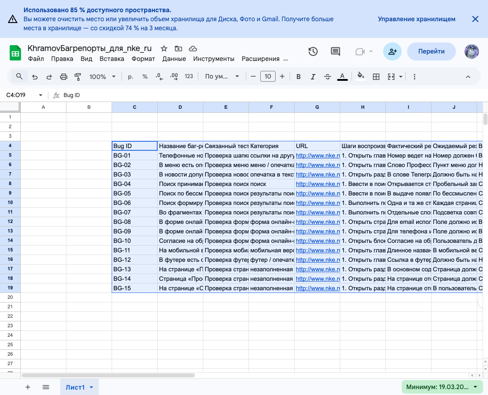
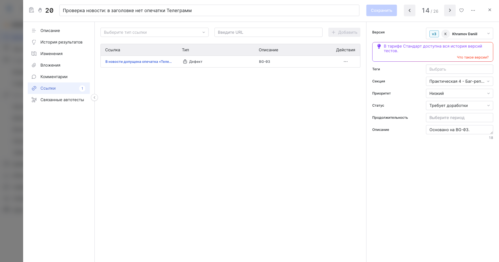
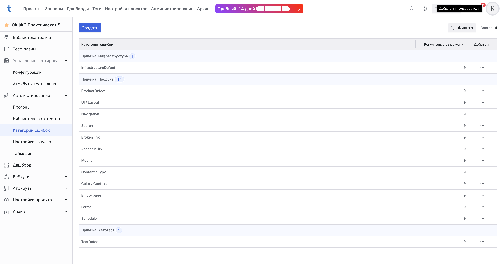
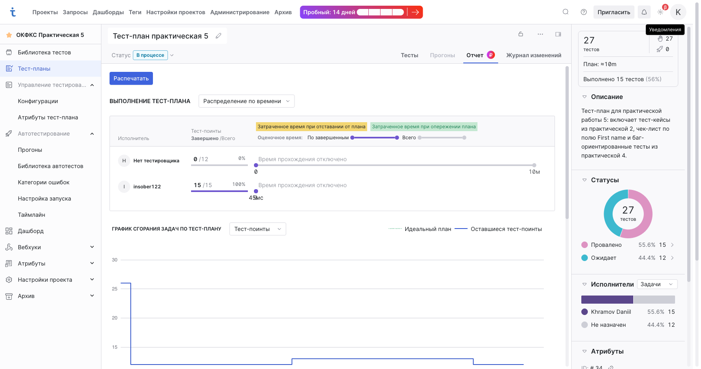

## Практическая работа 5. Система управления тестированием ПО TestIT

**Дисциплина:** Обеспечение качества функционирования компьютерных систем  
**Студент:** `Храмов Даниил Романович`  
**Группа:** `9ИС-495К`  
**Дата выполнения:** `19.03.2026`

> Отчет обновлен по фактическому состоянию проекта в TestIT на `19.03.2026`. Реальные скриншоты уже подключены для проекта, импорта, секций, Google Sheets, категорий ошибок, `Defect`-связей и тест-плана. Отдельно вручную при необходимости стоит заменить только скриншоты регистрации / пространства.

## Цель работы

Освоить базовые возможности системы управления тестированием TestIT: регистрацию, создание пространства и проекта, импорт тестовой документации, организацию секций и наборов, работу со ссылками, тегами, атрибутами, категориями ошибок и тест-планами.

## Импорт и перенос тестовой документации

В проект были перенесены тест-кейсы из практической работы 2. Перенос можно выполнить двумя способами:

1. Через импорт `XLSX`, если тест-кейсы заранее подготовлены в таблице.
2. Вручную, если тест-кейсов немного или их нужно переработать под структуру TestIT.

В моем случае был использован импорт из `XLSX`.

**Источник тест-кейсов:** локальный файл `testit_import_practice2_first_name_clean.xlsx`  
**Количество перенесенных тест-кейсов:** `11`  
**Раздел проекта для импорта:** `Практическая 2 - First Name`



## Перенос чек-листа и организация секций

Чек-лист был создан и добавлен в секцию с тестами по полю `First name`. Так как тест-кейсы из практической работы 2 не относятся к сайту колледжа, они были размещены в отдельной секции, отличной от секции с кейсами по сайту `nke.ru`.

Фактическая структура секций проекта:

1. `Практическая 2 - First Name`
2. `Практическая 4 - Баг-репорты nke.ru`

Для секций были указаны предусловия и постусловия там, где это уместно.

**Предусловие секции с кейсами по полю First Name:** открыта форма регистрации, поле `First name` доступно для ввода.  
**Постусловие секции:** поле очищено, форма возвращена в исходное состояние.  
**Дополнительно:** после импорта были архивированы 3 служебные строки из листа `Readme`, чтобы в секции остались только реальные рабочие элементы.



## Создание тест-кейсов по чек-листу

На основе ранее составленного чек-листа и импортированного набора тестов была сформирована секция с тестами по полю `First name`. Дополнительно в этой же секции создан отдельный чек-лист `Чек-лист проверки поля First name` с восемью пунктами проверки.

Примеры логических групп:

1. Валидный ввод
2. Граничные значения длины
3. Недопустимые символы
4. Локализация и алфавиты
5. Негативные сценарии



## Создание тест-кейсов на основе баг-репортов

На основе баг-репортов из практической работы 4 были созданы отдельные тест-кейсы, направленные на воспроизведение ошибок. Они вынесены в отдельную секцию `Практическая 4 - Баг-репорты nke.ru`.

Для сохранения трассировки использовались одинаковые или максимально близкие названия и описания дефектов в баг-репорте и в карточке тест-кейса.

Пример оформления связей:

1. `TC_BUG_001 - Некорректная работа поиска`
2. `TC_BUG_002 - Пустая страница раздела`
3. `TC_BUG_003 - Ошибка мобильного отображения`


По состоянию на момент подготовки отчета для этих тестов в тест-плане уже выставлен результат **Провален**. Для всех баг-ориентированных тест-кейсов дополнительно созданы ссылки типа **Дефект**, ведущие на соответствующие строки Google Sheets-таблицы с баг-репортами.

## Google Sheets и связи Defect

Для хранения баг-репортов была создана отдельная Google Sheets-таблица:

**Название таблицы:** `KhramovБагрепорты_для_nke_ru`  
**Ссылка на таблицу:** [KhramovБагрепорты_для_nke_ru](https://docs.google.com/spreadsheets/d/1l8_rcHw_ZyikXlqQb2emOOyDXfKThrRwc-xGJluPEnQ/edit?gid=0#gid=0)  
**Содержимое:** `15` баг-репортов с идентификаторами `BG-01` ... `BG-15`

В таблицу были внесены:

1. Идентификатор бага
2. Название баг-репорта
3. Связанный тест-кейс в TestIT
4. Категория
5. URL страницы
6. Шаги воспроизведения
7. Фактический результат
8. Ожидаемый результат
9. Важность, срочность, статус, автор и дата

Для тест-кейсов из секции `Практическая 4 - Баг-репорты nke.ru` были созданы ссылки типа `Дефект`, причем:

1. Ссылка ведет не просто на таблицу, а на конкретную строку нужного баг-репорта.
2. Заголовок ссылки совпадает с названием баг-репорта.
3. В описании ссылки сохранен идентификатор вида `BG-03`, `BG-10` и т.д.

Это позволяет сохранить трассировку между тест-кейсом и баг-репортом и быстро переходить к нужной записи в Google Sheets.





## Категории ошибок

В разделе **Автотестирование -> Категории ошибок** были добавлены категории, соответствующие найденным дефектам. Ниже приведен пример набора категорий, который подходит под баг-репорты по сайту колледжа:

1. `UI / Layout`
2. `Navigation`
3. `Search`
4. `Broken link`
5. `Accessibility`
6. `Mobile`
7. `Content / Typo`
8. `Color / Contrast`
9. `Empty page`
10. `Forms`
11. `Schedule`



## Создание тест-плана

После подготовки тестовой документации был создан тест-план, в который включены:

1. Тест-кейсы по чек-листу из практической работы 2
2. Тест-кейсы на воспроизведение дефектов из практической работы 4
3. Секции и/или наборы, соответствующие структуре библиотеки тестов

**Название тест-плана:** `Тест-план практическая 5`  
**Включенные наборы:** `Набор практической 5`  
**Состав тест-плана:** `27` тестов  
**Результаты по состоянию на момент фиксации:** `15` тестов отмечены как `Провален`, `12` находятся в статусе `Ожидает`



## Ответы на вопросы по документации TestIT

1. **Что такое параметры и как их создавать?**  
   Параметры в TestIT представляют собой характеристики окружения или переменные тестовых данных, которые помогают избегать дублирования тест-кейсов. Их можно использовать в самих тестах и в конфигурациях. Если в тест-кейсе указан параметр с несколькими значениями, а затем тест добавлен в набор, в тест-плане формируются отдельные тест-поинты по значениям параметров.  
   Создание параметров выполняется через раздел **Настройки проектов -> Параметры**: нужно указать название параметра, проекты, где он будет использоваться, и набор допустимых значений. В самом тесте параметр подставляется через символ `%` в шаге.  
   **Источники:** [Добавление параметров в тесты](https://docs.testit.software/user-guide/sections/use-parameters-in-tests.html), [Работа с параметрами и конфигурациями](https://docs.testit.software/user-guide/create-configurations.html)

2. **Для чего необходимо поле продолжительность?**  
   Поле продолжительности нужно для оценки времени выполнения тестов и планирования нагрузки. По документации TestIT оценочное время используется в отчете по тест-плану: там можно отслеживать запланированное время, затраченное время и отставание от графика, а на диаграмме сгорания задач ось Y может отображать именно оценочную продолжительность выполнения тест-поинтов.  
   Следовательно, это поле полезно для оценки трудозатрат, балансировки работы тестировщиков и контроля соблюдения сроков. Это вывод по документации отчета и аналитики тест-плана.  
   **Источники:** [Отчет по тест-плану](https://docs.testit.software/user-guide/manual-testing-workflow/test-plan-report.html)

3. **Для чего необходимы ссылки в проекте, как их создавать и использовать?**  
   Ссылки нужны для связи рабочих элементов с дефектами, задачами, требованиями, репозиториями и другими связанными объектами. Они позволяют трассировать происхождение теста, быстро переходить к связанным артефактам и отслеживать статус связанных задач и дефектов.  
   Чтобы создать ссылку, нужно открыть рабочий элемент, перейти в раздел **Ссылки**, указать тип ссылки и URL, затем сохранить ее. При редактировании можно задать или изменить URL, заголовок, описание и тип ссылки.  
   В данной работе ссылки особенно полезны для связи тест-кейсов, созданных по баг-репортам, с самими баг-репортами через тип ссылки **Дефект**.  
   **Источники:** [Добавление ссылок в тесты](https://docs.testit.software/user-guide/sections/add-links-to-work-items.html)

4. **Разработайте систему тегов для тест-кейсов из 2-й практической.**  
   Для тест-кейсов по полю `First name` удобно использовать префиксную систему тегов, чтобы их было легко фильтровать:

   | Группа | Примеры тегов | Назначение |
   | --- | --- | --- |
   | Функциональность | `feature:registration`, `field:first-name` | К какой части системы относится тест |
   | Тип сценария | `type:positive`, `type:negative` | Быстрая фильтрация по позитивным и негативным кейсам |
   | Вид проверки | `check:boundary`, `check:validation`, `check:format`, `check:required` | Что именно проверяется |
   | Данные | `data:cyrillic`, `data:latin`, `data:digits`, `data:hyphen`, `data:space`, `data:empty`, `data:max-length`, `data:over-limit` | Какие входные данные используются |
   | Риск / качество | `risk:usability`, `risk:localization`, `risk:input-sanitization` | Для группировки по типу риска |

   Примеры комбинаций:

   1. `feature:registration`, `field:first-name`, `type:positive`, `check:validation`, `data:cyrillic`
   2. `feature:registration`, `field:first-name`, `type:negative`, `check:boundary`, `data:over-limit`
   3. `feature:registration`, `field:first-name`, `type:negative`, `check:format`, `data:digits`

   Такая система помогает быстро искать кейсы, делать выборки для регрессии и поддерживать единый стиль тегирования в проекте.  
   **Источник по механике тегов:** [Использование тегов](https://docs.testit.software/user-guide/sections/add-tags-to-tests.html)

5. **Что такое общий шаг, как его создать и использовать?**  
   Общий шаг — это переиспользуемый шаг теста, который хранится в библиотеке как отдельный рабочий элемент и может применяться в нескольких тест-кейсах. Он нужен для сокращения дублирования и упрощения сопровождения однотипных сценариев.  
   Общий шаг можно:

   1. Создать как отдельный рабочий элемент в библиотеке тестов.
   2. Создать на основе уже написанных шагов тест-кейса через команду **Создать общий шаг**.
   3. Добавить в тест-кейс через меню шага **Добавить общий шаг**.

   После вставки общий шаг можно развернуть, расформировать, дублировать или удалить из конкретного тест-кейса.  
   **Источники:** [Добавление общего шага в тест](https://docs.testit.software/user-guide/sections/add-shared-step-to-test-case.html), [Выделение шагов теста в общий шаг](https://docs.testit.software/user-guide/sections/convert-actions-into-a-shared-step.html), [Сравнение типов рабочих элементов](https://docs.testit.software/user-guide/sections/compare-work-item-types.html)

6. **Как выглядит конфигурационный файл для импорта тест-кейсов, что он из себя представляет и как его написать?**  
   При импорте `XLSX` TestIT позволяет сохранить конфигурационный файл в формате `.json`. По документации он нужен для автоматического восстановления настроек импорта: стартовой строки, режима форматирования, соответствия колонок Excel полям TestIT и сопоставления значений для атрибутов типа **Варианты на выбор**.  
   Официальная документация описывает назначение такого файла и сценарий его сохранения, но не публикует полную JSON-схему. Поэтому на практике правильнее сначала один раз настроить импорт через интерфейс, сохранить конфигурацию, а затем использовать полученный `.json` как основу для повторных импортов.  
   Ниже приведен **иллюстративный пример** структуры такого файла. Это именно пример по логике работы интерфейса, а не дословный образец из документации:

   ```json
   {
     "startRow": 2,
     "textFormattingMode": "PlainText",
     "mappings": {
       "ID": "ExternalId",
       "Название": "Name",
       "Предусловия": "Preconditions",
       "Шаги": "Steps",
       "Ожидаемый результат": "ExpectedResult",
       "Приоритет": "Priority",
       "Тип": "WorkItemType"
     },
     "enumMappings": {
       "Приоритет": {
         "крайне высокий": "Highest",
         "высокий": "High",
         "средний": "Medium",
         "низкий": "Low"
       }
     },
     "targetSection": "Практическая 2 / Импорт"
   }
   ```

   Такой файл по сути является сохраненной картой соответствия между таблицей и полями TestIT.  
   **Источники:** [Импорт тестовой документации из XLS и XLSX](https://docs.testit.software/user-guide/sections/import-tests/import-test-cases-from-xlsx-files.html)

7. **Что такое атрибуты, где они используются и как их создать?**  
   Атрибуты — это пользовательские поля, с помощью которых можно настраивать карточки рабочих элементов и тест-планов. В проекте TestIT доступны атрибуты тест-плана, проектные атрибуты, глобальные атрибуты и шаблоны атрибутов. Проектные и глобальные атрибуты добавляют дополнительные поля в рабочие элементы проекта, а атрибуты тест-плана — в тест-планы.  
   Атрибуты используются для хранения дополнительной информации, например сроков, исполнителей, пользовательских статусов классификации, приоритетных меток или доменных признаков. Создание проектного атрибута выполняется через **Атрибуты -> Проектные атрибуты -> Создать**, затем задаются название, обязательность, тип и, при необходимости, варианты выбора.  
   **Источники:** [Настройка атрибутов в проекте](https://docs.testit.software/user-guide/work-with-projects/set-up-attributes.html), [Глоссарий](https://docs.testit.software/user-guide/glossary.html)

8. **Для чего можно использовать дашборд, как создавать в нем виджеты, что они могут отражать?**  
   Дашборд в TestIT нужен для визуализации аналитики по тестированию. Через него можно отслеживать состояние тестов, тест-планов, прогонов, автотестов и активность команды.  
   Виджет создается так: нужно открыть дашборд, нажать **Создать** или **Добавить виджет**, указать название, выбрать формат отображения, тип данных и способ группировки, затем сохранить.  
   Виджеты могут отображать:

   1. Результаты тестов
   2. Тесты
   3. Автотесты
   4. Тест-планы
   5. Прогоны
   6. Активность команды

   Форматы визуализации включают круговую диаграмму, тренды, линейчатую диаграмму, таблицу, команду и таймлайн. Например, для тестов из библиотеки можно строить аналитику по статусу, приоритету, типу автоматизации, авторам и покрытию ссылками.  
   **Источники:** [Работа с виджетами](https://docs.testit.software/user-guide/dashboards/work-with-widgets/), [Анализ тестов, хранящихся в библиотеке](https://docs.testit.software/user-guide/dashboards/work-with-widgets/visualize-test-data.html), [Анализ тест-планов](https://docs.testit.software/user-guide/dashboards/work-with-widgets/visualize-test-plans.html)

9. **Что значат пользовательские наборы тест-кейсов и наборы из секции?**  
   В TestIT тестовый набор — это часть тест-плана, в которую входят тесты, подготовленные к выполнению. Пользовательский набор содержит тесты, которые пользователь выбрал вручную из библиотеки. Такой набор удобен, когда нужно собрать произвольную подборку кейсов под конкретную цель, например smoke или проверку отдельной функции.  
   Набор из секции библиотеки формируется на основе выбранной секции библиотеки тестов, получает идентичное название и включает все вложенные секции. Такой вариант удобен, когда структура тест-плана должна повторять структуру библиотеки тестов.  
   Дополнительно в системе существуют динамические наборы, но в вопросе требуются именно первые два типа.  
   **Источники:** [Формирование тестового набора](https://docs.testit.software/user-guide/manual-testing-workflow/build-up-test-suite.html), [Структура и компоненты проекта](https://docs.testit.software/user-guide/work-with-projects/project-structure-and-components.html)

10. **Для чего нужен приватный API-токен пользователя?**  
   Приватный API-токен нужен для работы с API TestIT. Он используется для авторизации в Swagger и в других инструментах, которые взаимодействуют с системой программно. В интерфейсе Swagger авторизация выполняется в формате `PrivateToken {API Secret Key}`.  
   Такой токен можно применять для интеграций, автоматизации, использования API-клиентов и импортера / мигратора TestIT. Токен создается в профиле пользователя во вкладке **Безопасность**. Документация отдельно предупреждает, что токен нужно сохранить сразу после генерации, так как позже его значение больше не показывается.  
   **Источники:** [Настройки профиля и создание API-токена](https://docs.testit.software/user-guide/user-settings.html), [Работа с API](https://docs.testit.software/user-guide/work-with-api.html), [Загрузка тест-кейсов в Test IT с помощью импортера](https://docs.testit.software/user-guide/migration/importer.html)

