# Отчет по 6 практической работе: тестирование с помощью DevTools

Группа: `9ИС-495К`  
ФИО: `Храмов Даниил Романович`  
Дата проверки: `19.03.2026`  
Браузер: `Google Chrome 146.0.7680.153`

Примечание: тренажер генерирует часть сценариев случайно при каждой загрузке страницы. Ниже зафиксирован один полный прогон.

## Краткий итог

| № | Задание | Результат |
|---|---|---|
| 1 | Метод запроса | Корректно |
| 2 | Статус ответа | Корректно |
| 3 | JSON в запросе | Есть баг |
| 4 | JSON в ответе | Есть баг |
| 5 | Cookie | Корректно |
| 6 | Заголовки запроса | Корректно |
| 7 | Заголовки ответа | Есть баг |
| 8 | Query параметры | Есть баг |
| 9 | Local storage | Есть баг |
| 10 | Session storage | Есть баг |
| 11 | Кэш браузера | Демонстрационное задание |
| 12 | Мобильная вёрстка | Есть баг |
| 13 | CSS цвет | Есть баг |
| 14 | CSS шрифт | Есть баг |
| 15 | Валидация поля | Есть баг |

## Подробные результаты

### 1. Метод запроса

- Ожидаемо: запрос должен отправляться методом `POST`.
- Фактически: в `Network` зафиксирован метод `POST`, статус ответа `200`.
- Вывод: баг не обнаружен.

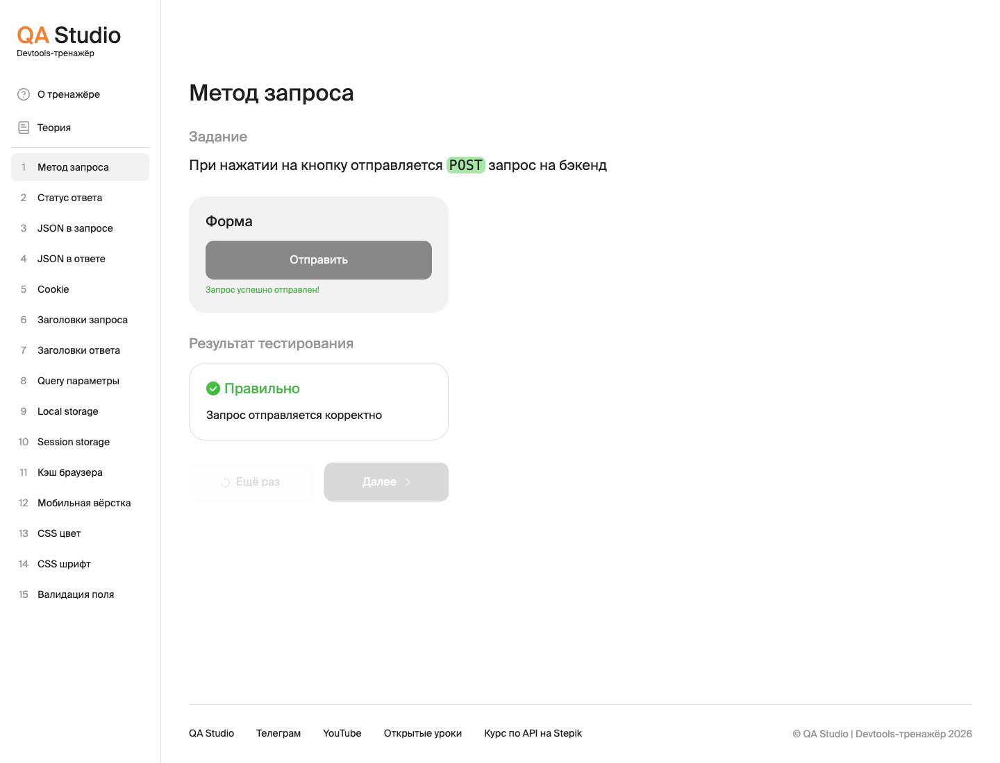

### 2. Статус ответа

- Ожидаемо: сервер должен вернуть статус `201`.
- Фактически: в `Network` получен статус `201`.
- Вывод: баг не обнаружен.

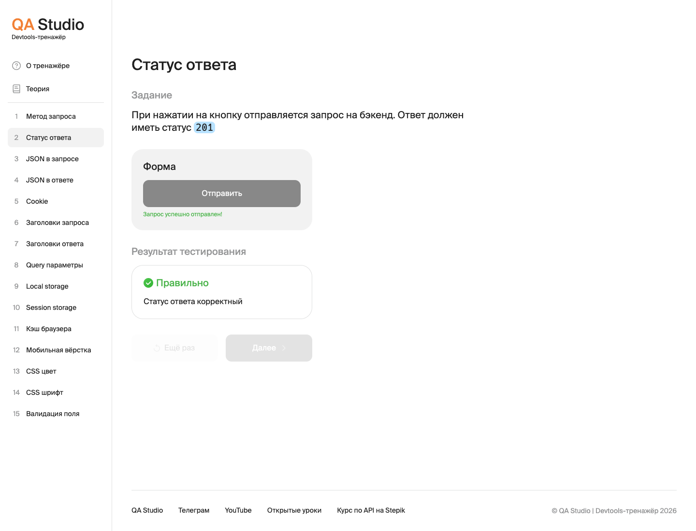

### 3. JSON в запросе

- Ожидаемо: в body запроса должен передаваться JSON вида `{"name":"Ivan"}`.
- Фактически: в `Payload` ушло тело `{}`.
- Вывод: есть баг, данные в JSON передаются некорректно.

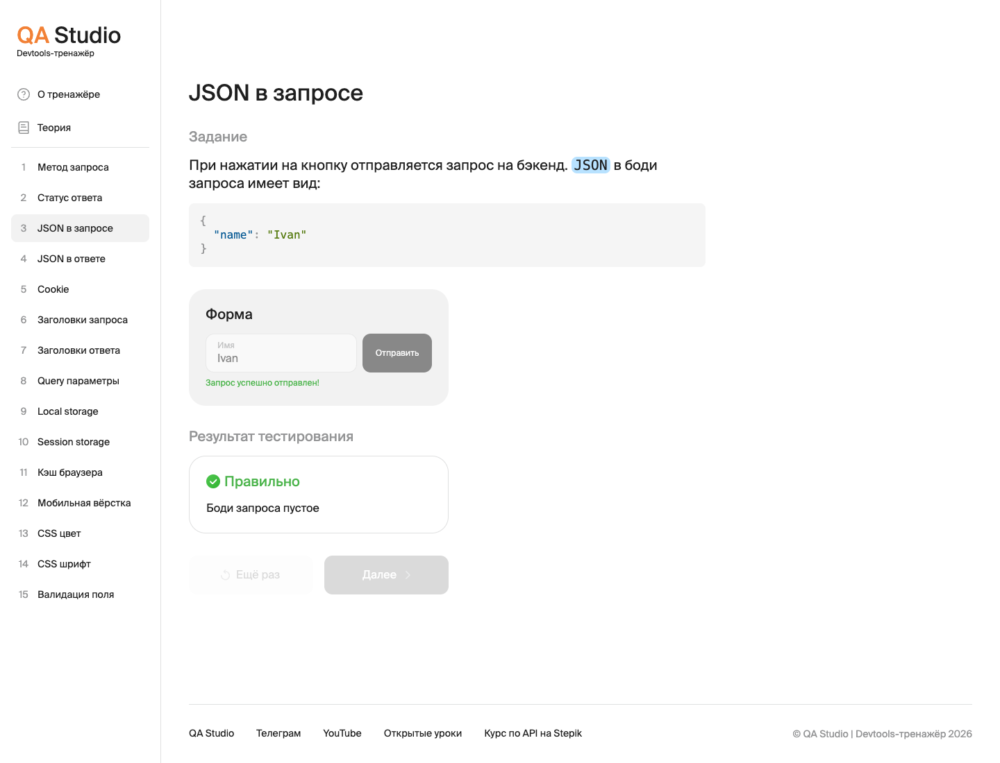

### 4. JSON в ответе

- Ожидаемо: ответ должен быть в формате `JSON` с `Content-Type: application/json`.
- Фактически: сервер вернул `Content-Type: application/xml`, body: `<?xml version="1.0"?><QaStudioStudent>false</QaStudioStudent>`.
- Вывод: есть баг, вместо JSON приходит XML.

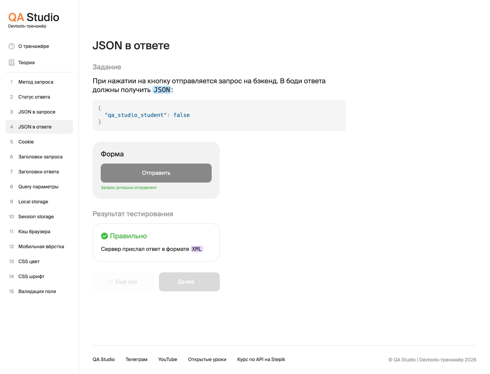

### 5. Cookie

- Ожидаемо: cookie `devtools_session_id` должна устанавливаться со свойствами `HttpOnly`, `Secure` и сроком `1 год`.
- Фактически: `Set-Cookie: devtools_session_id=...; Max-Age=31536000; Path=/; HttpOnly; Secure; SameSite=Lax`.
- Вывод: баг не обнаружен.

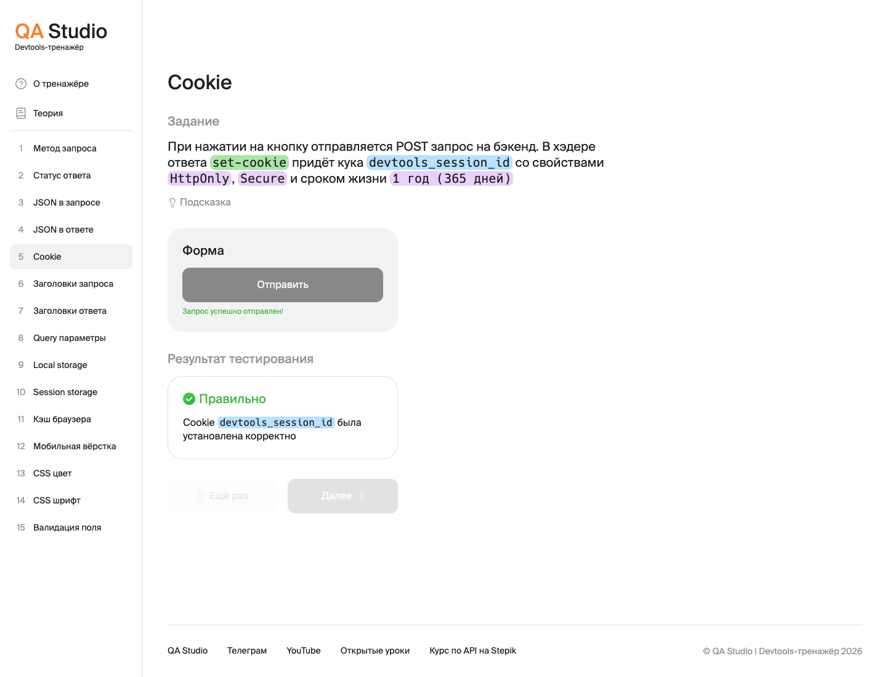

### 6. Заголовки запроса

- Ожидаемо: в запросе должен присутствовать заголовок `X-User-Id`.
- Фактически: в `Request Headers` передан `X-User-Id: 3387a4e6-3013-4fb2-bb64-828fd71cfd06`.
- Вывод: баг не обнаружен.

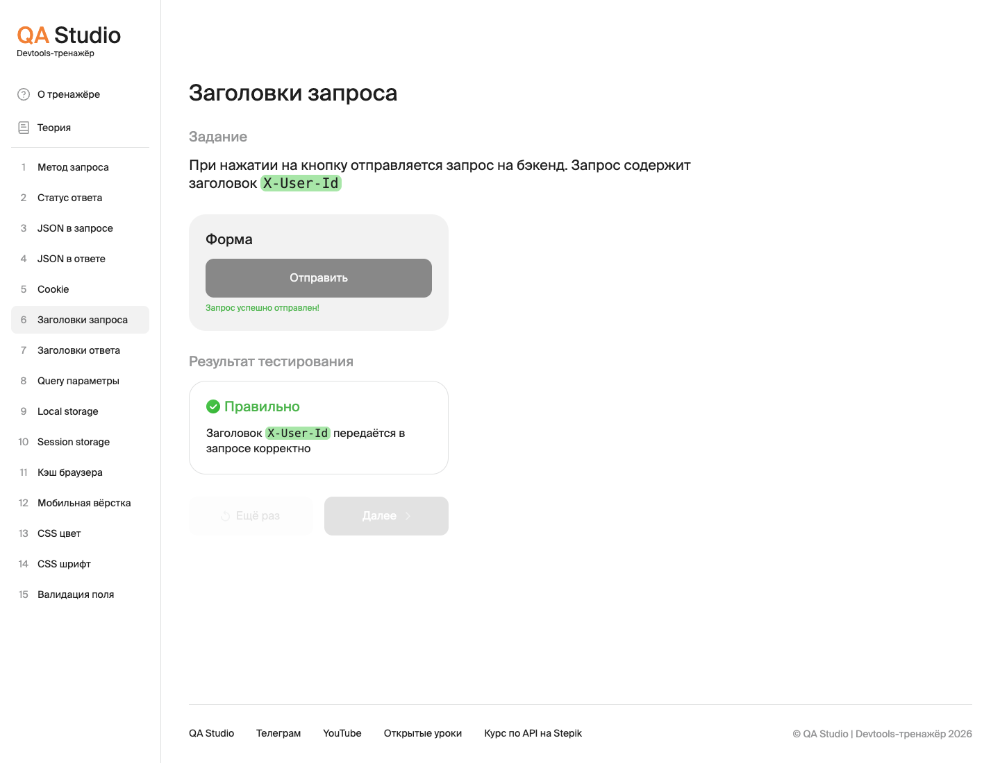

### 7. Заголовки ответа

- Ожидаемо: в ответе должен присутствовать заголовок `X-Request-Id`.
- Фактически: в `Response Headers` заголовок отсутствует, при этом в запросе был передан `X-Request-Id`.
- Вывод: есть баг, заголовок ушел в запрос вместо ответа.

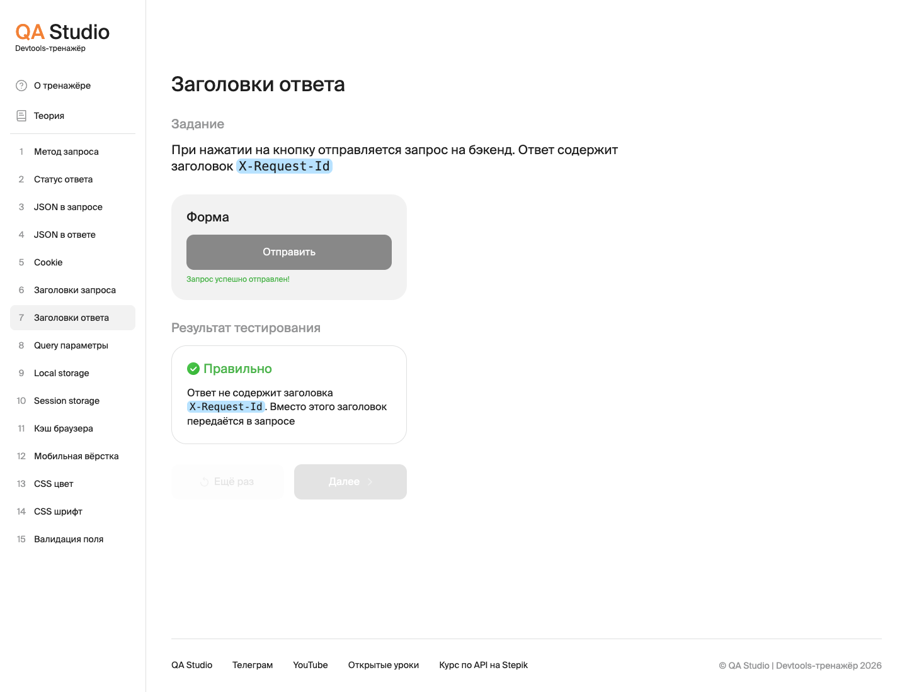

### 8. Query параметры

- Ожидаемо: в URL должен передаваться query-параметр `section=3`.
- Фактически: в URL query-параметров нет, данные ушли в body: `{"section":"3"}`.
- Вывод: есть баг, параметры передаются не через query string.

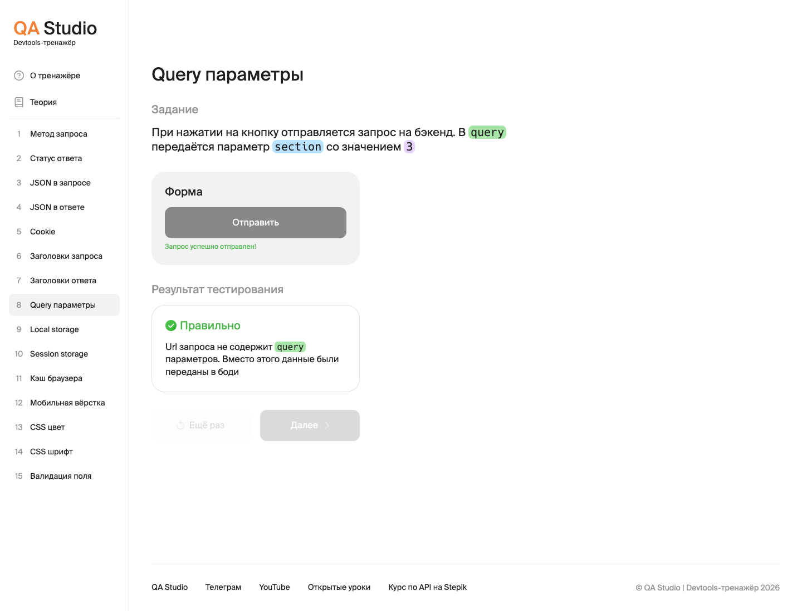

### 9. Local storage

- Ожидаемо: значение поля «Имя» должно сохраняться в `localStorage` по ключу `name`.
- Фактически: значение сохранилось по ключу `address=Ivan`.
- Вывод: есть баг, используется неверный ключ.

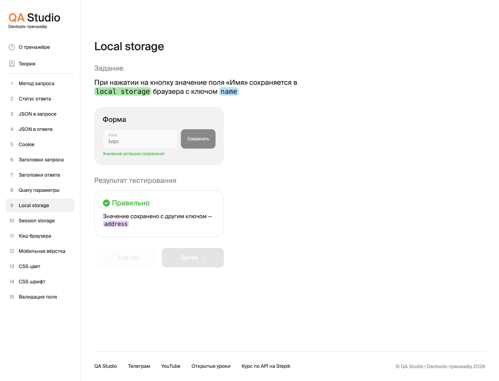

### 10. Session storage

- Ожидаемо: значение поля «Имя» должно сохраняться в `sessionStorage` по ключу `name`.
- Фактически: в `sessionStorage` значение не найдено.
- Вывод: есть баг, данные не сохраняются.

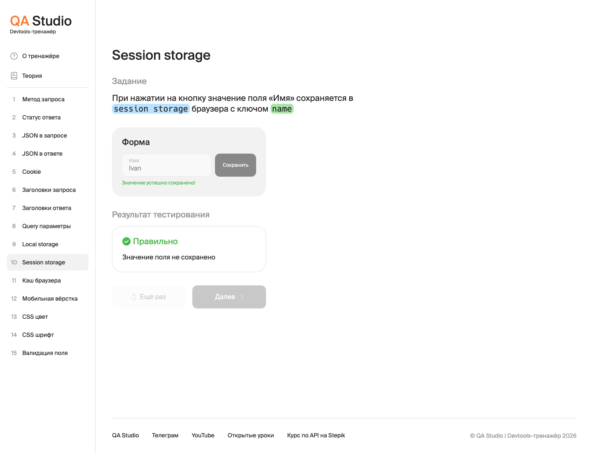

### 11. Кэш браузера

- Задание демонстрационное, без выбора ответа в тренажере.
- Фактически: в headless-проверке был создан `Cache Storage` с именем `cache`, но `cat.png` в списке ключей не появился.
- Примечание: для этого задания рекомендуется дополнительная ручная проверка во вкладках `Network` и `Application` в обычном браузере.

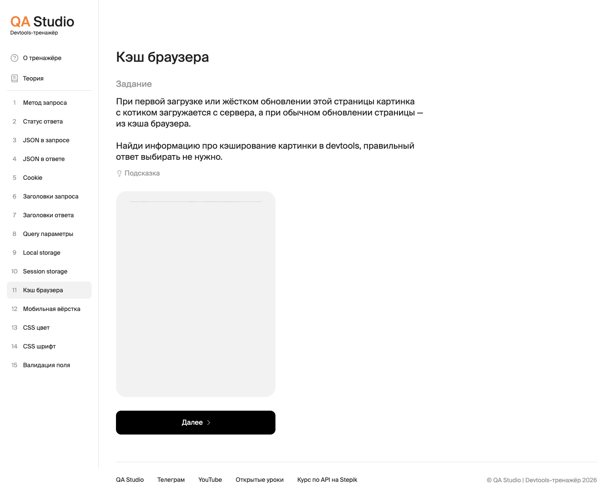

### 12. Мобильная вёрстка

- Ожидаемо: при размере экрана `380x685` кнопка должна располагаться под полем ввода.
- Фактически: кнопка осталась в одной строке с полем (`y` поля `452`, `y` кнопки `451`).
- Вывод: есть баг, мобильная вёрстка не соответствует ожиданию.

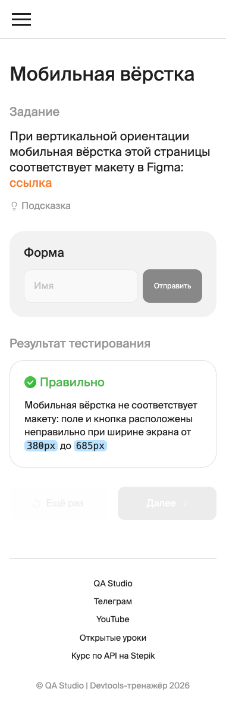

### 13. CSS цвет

- Ожидаемо: цвет кнопки `#f28338`.
- Фактически: вычисленный цвет кнопки `rgb(222, 115, 42)`, что соответствует `#de732a`.
- Вывод: есть баг, цвет задан неверно.

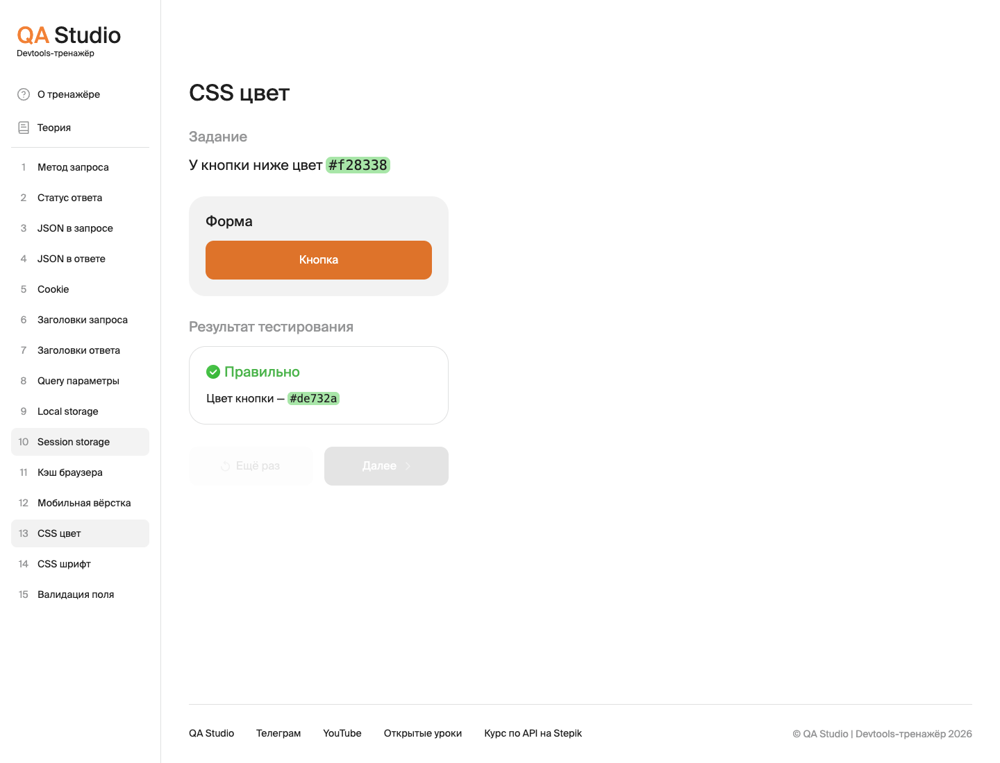

### 14. CSS шрифт

- Ожидаемо: шрифт `SuisseIntl`, размер `24px`.
- Фактически: `font-family: SuisseIntl, sans-serif`, `font-size: 20px`.
- Вывод: есть баг, размер шрифта неверный.

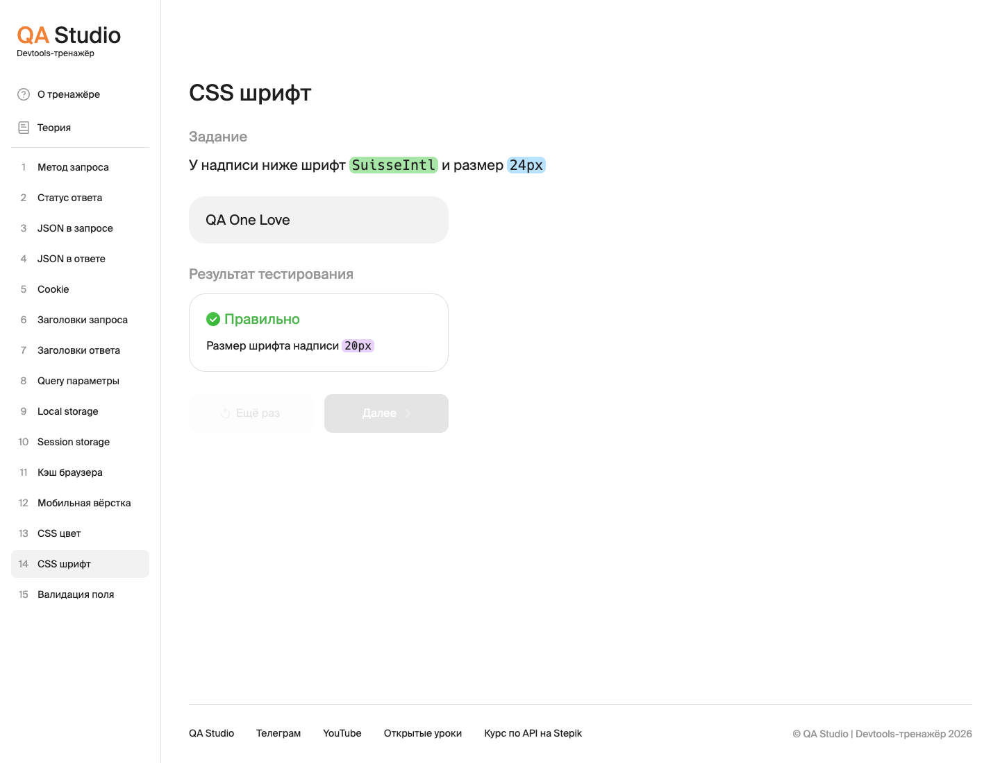

### 15. Валидация поля

- Ожидаемо: бэкенд должен возвращать ошибку на невалидный email.
- Фактически: прямой `POST` с `bad-email` вернул успешный ответ: `{"message":"Адрес электронной почты успешно получен","data":{"email":"bad-email"}}`.
- Дополнительно: UI-запрос с валидным email `student@example.com` тоже завершился успешно.
- Вывод: есть баг, серверная валидация email не реализована.

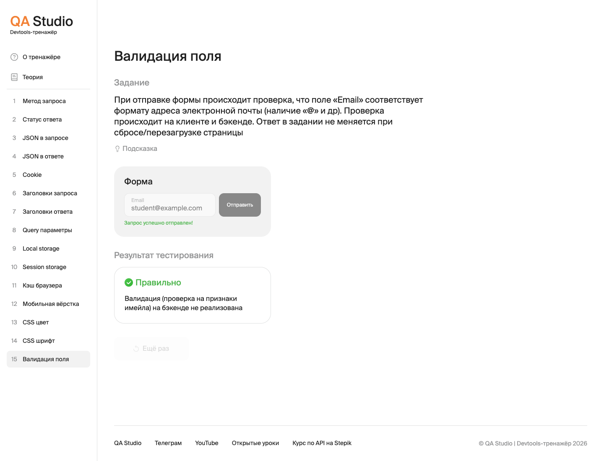
