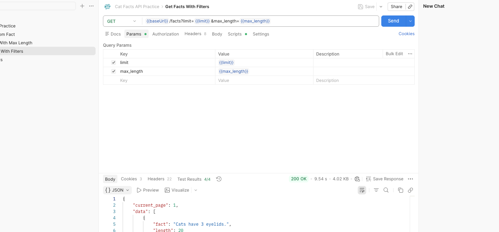
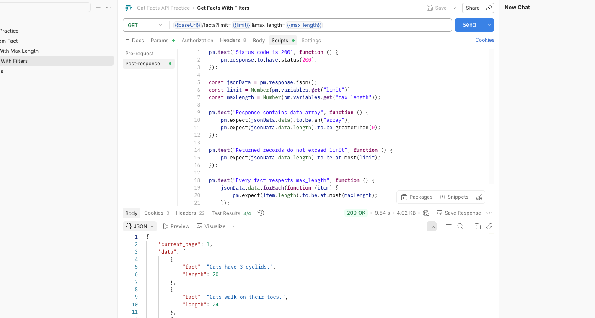
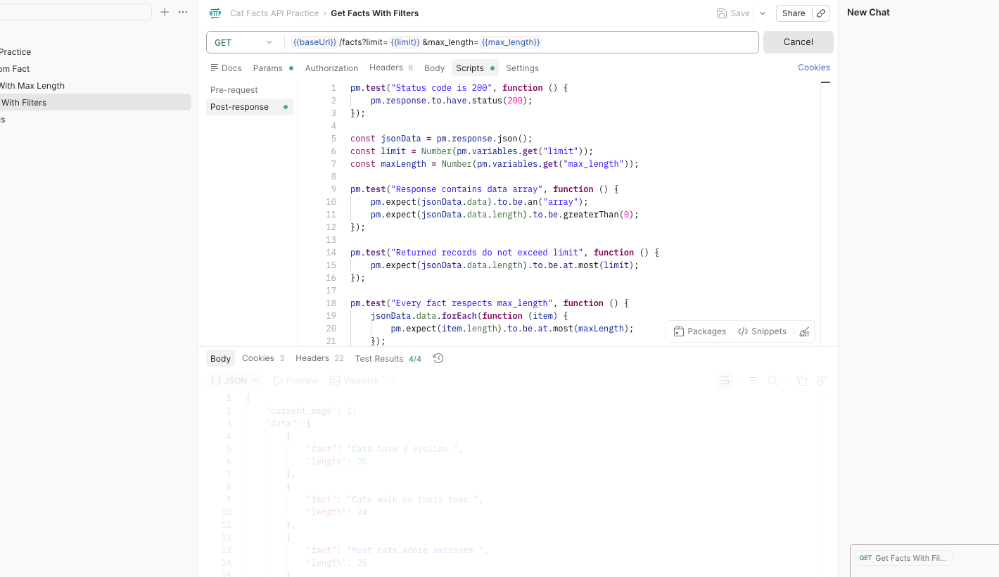
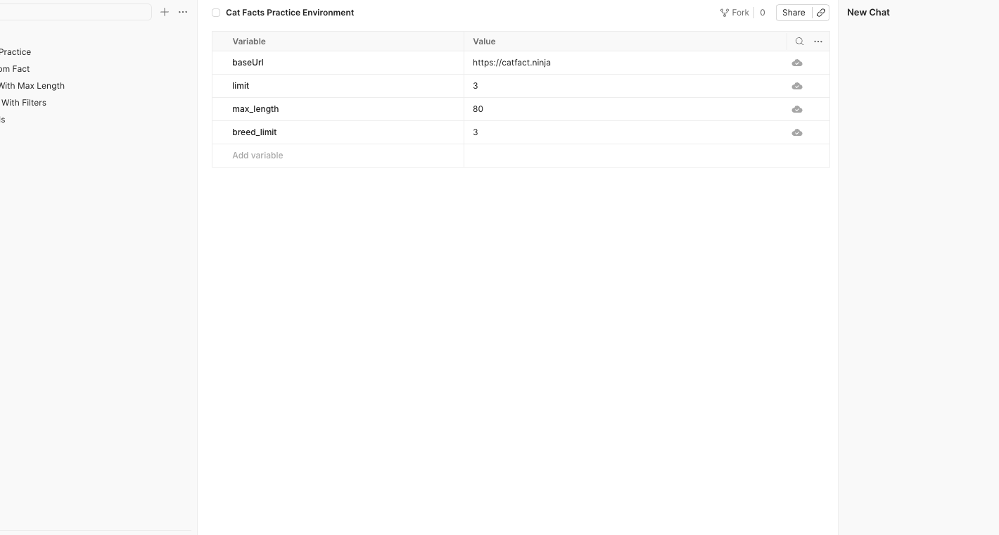
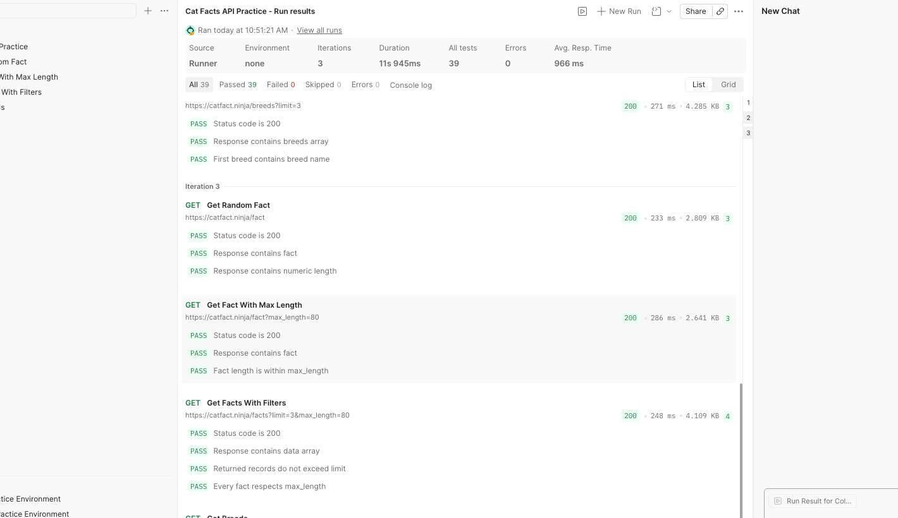
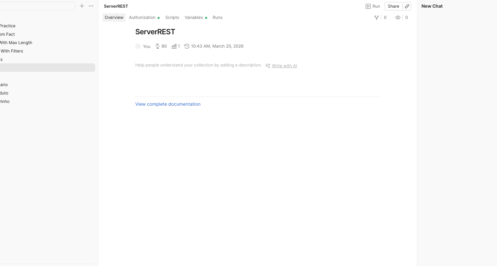
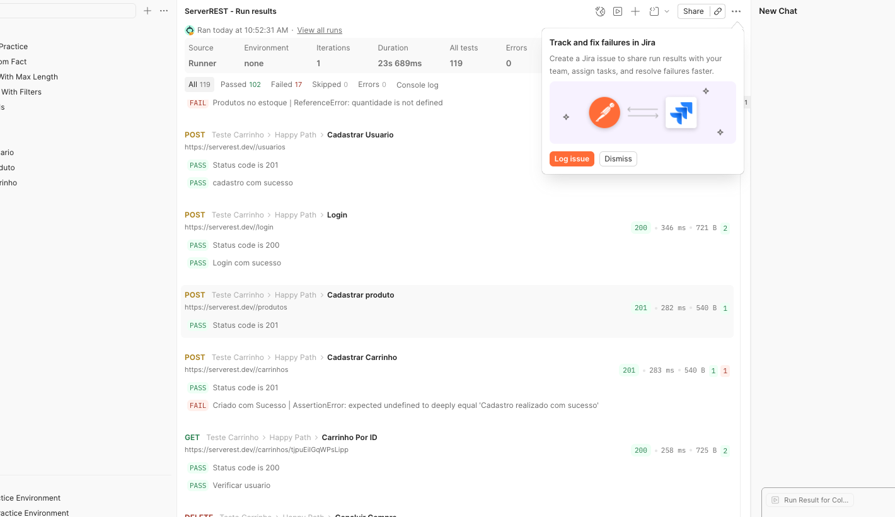
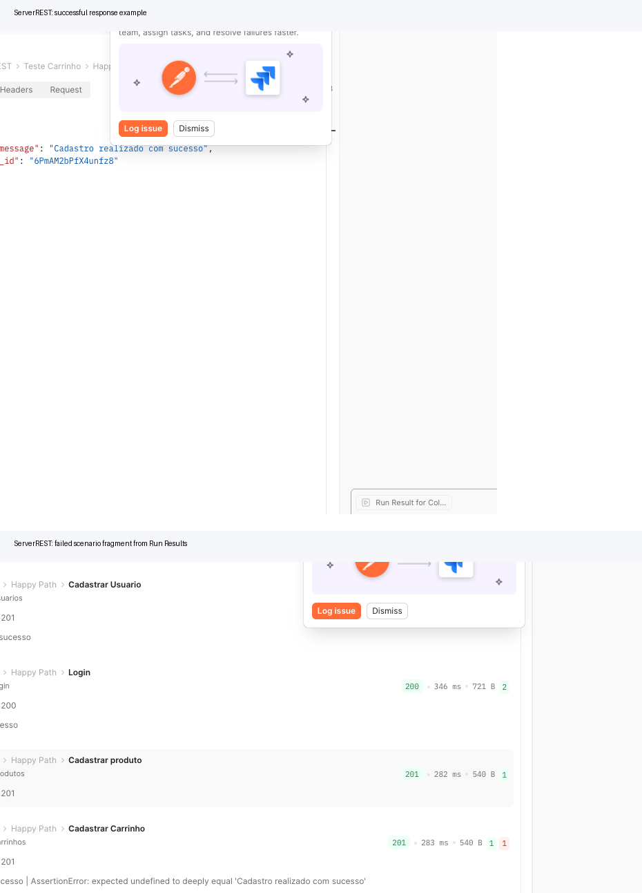

# 7 практическая работа. Postman

Дата выполнения: 20.03.2026

## Задание 1. Работа с выбранным публичным API

### Выбранный API

Для выполнения задания выбран публичный API `Cat Facts API`.

- Базовый URL: `https://catfact.ninja`
- Авторизация: не требуется
- Назначение: получение фактов и справочной информации о кошках
- Файлы коллекции и окружения: `data/CatFacts.postman_collection.json`, `data/CatFacts.postman_environment.json`

### Краткое описание запросов

| Запрос | Метод | URL | Назначение |
| --- | --- | --- | --- |
| `Get Random Fact` | `GET` | `{{baseUrl}}/fact` | Получение случайного факта о кошках |
| `Get Fact With Max Length` | `GET` | `{{baseUrl}}/fact?max_length={{max_length}}` | Получение факта с ограничением длины |
| `Get Facts With Filters` | `GET` | `{{baseUrl}}/facts?limit={{limit}}&max_length={{max_length}}` | Получение списка фактов с фильтрацией |
| `Get Breeds` | `GET` | `{{baseUrl}}/breeds?limit={{breed_limit}}` | Получение списка пород |

### Скриншот конструктора запроса

На скриншоте показан запрос `Get Facts With Filters`: метод, URL, query-параметры и переменные коллекции.

### Скриншот вкладки со скриптами проверки

В веб-версии Postman проверки расположены во вкладке `Scripts`, блок `Post-response`. Для запроса `Get Facts With Filters` добавлены проверки:

- код ответа `200`;
- наличие массива `data`;
- непустой ответ;
- ограничение количества записей по `limit`;
- ограничение длины факта по `max_length`.

### Результат отправки запроса и Test Results

После отправки запроса `Get Facts With Filters` API вернул `200 OK`, а встроенные проверки Postman отработали со статусом `4/4 passed`.

### Вывод по заданию 1

Задание выполнено: создана собственная коллекция Postman с 4 запросами к публичному API, для каждого запроса добавлены автоматические проверки, запросы успешно выполняются.

## Задание 2. Переменные, окружения и Collection Runner

### Использованные переменные и окружения

В коллекции `Cat Facts API Practice` используются переменные:

- `baseUrl = https://catfact.ninja`
- `limit = 3`
- `max_length = 80`
- `breed_limit = 3`

Дополнительно создано окружение `Cat Facts Practice Environment` с теми же значениями для наглядной работы в Postman Web.

Для пакетного запуска подготовлены файлы данных:

- `data/catfact-data.csv`
- `data/catfact-data.json`

### Результаты запуска через Collection Runner

В Postman выполнен многократный прогон коллекции на `3` итерации. Для запуска подготовлены CSV/JSON-файлы с наборами значений `limit` и `max_length`; итоговые результаты также сохранены в `results/`.

| Прогон | Итерации | Запросы | Assertions | Ошибок |
| --- | --- | --- | --- | --- |
| `results/catfacts-base.json` | 1 | 4 | 13 | 0 |
| `results/catfacts-csv.json` | 3 | 12 | 39 | 0 |
| `results/catfacts-json.json` | 3 | 12 | 39 | 0 |

### Вывод по заданию 2

Переменные и окружение настроены, коллекция успешно запускается пакетно, при повторных прогонах проверки проходят без ошибок.

## Работа с коллекцией ServerREST

### Импорт коллекции и структура сценариев

В Postman импортирована готовая коллекция `ServerREST` и окружение `ServerREST Practice Environment`.

Использованные файлы импорта: `data/ServerREST.postman_collection.json` и `data/ServerREST.postman_environment.json`.

Были проанализированы и запускались следующие разделы коллекции:

- `BASE`
- `Teste Usuario`
- `Teste Produto`
- `Teste Carrinho`

Внутри коллекции присутствуют как `Happy Path`, так и негативные сценарии.

### Основные сценарии и ожидаемые коды ответа

| Сценарий | Ожидаемые коды ответа | Назначение |
| --- | --- | --- |
| `Teste Usuario / Happy Path` | `201, 200, 200, 200, 400` | Базовый поток по пользователю |
| `Teste Usuario / Cadastro Com Email Já utilizado` | `201, 400, 200` | Проверка дубликата email |
| `Teste Produto / Produto com mesmo nome` | `201, 200, 201, 400, 200` | Проверка уникальности имени товара |
| `Teste Carrinho / Happy Path` | `201, 200, 201, 201, 200, 200` | Позитивный сценарий по корзине |
| `Teste Carrinho / ADD produtos no carrinho - diminui do estoque` | `201, 200, 201, 201, 200, 200` | Проверка изменения остатка товара |

### Результаты запуска коллекции

В Postman Web выполнен полный запуск коллекции `ServerREST`. По результатам UI-прогона:

- `All tests: 119`
- `Passed: 102`
- `Failed: 17`
- `Errors: 0`

Дополнительно по сохранённым результатам `newman` зафиксирована детализация по папкам:

| Папка коллекции | Файл результата | Запросы | Assertions | Ошибок |
| --- | --- | --- | --- | --- |
| `BASE` | `results/serverrest-base-fixed.json` | 17 | 10 | 0 |
| `Teste Usuario` | `results/serverrest-users-fixed.json` | 20 | 34 | 10 |
| `Teste Produto` | `results/serverrest-products-fixed.json` | 20 | 39 | 7 |
| `Teste Carrinho` | `results/serverrest-carts-fixed.json` | 23 | 36 | 3 |

### Примеры ответов

На следующем изображении показаны:

- пример успешного ответа `ServerREST`;
- фрагмент негативного сценария из `Run Results`, где воспроизводится падение проверки.

### Найденные проблемы в готовой коллекции

Во время запуска были подтверждены проблемы именно в импортированной готовой коллекции:

1. В `Teste Usuario / Happy Path` встречается расхождение между ожидаемым и фактическим именем пользователя.
2. В `Teste Carrinho / Cancela compra - volta produtos pro estoque / Listar produto por id` есть ошибка `quantidade is not defined`.
3. В `Teste Carrinho / Happy Path / Cadastrar Carrinho` часть проверок ожидает сообщение, которого нет в фактическом ответе.
4. В ряде негативных сценариев коллекция падает не из-за недоступности API, а из-за ошибок в самих тестовых ассертах.
